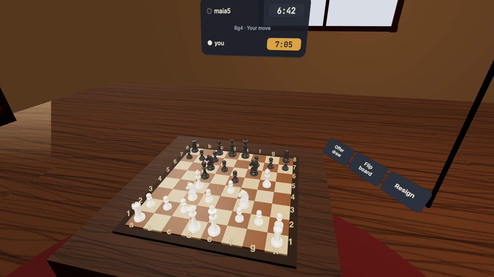
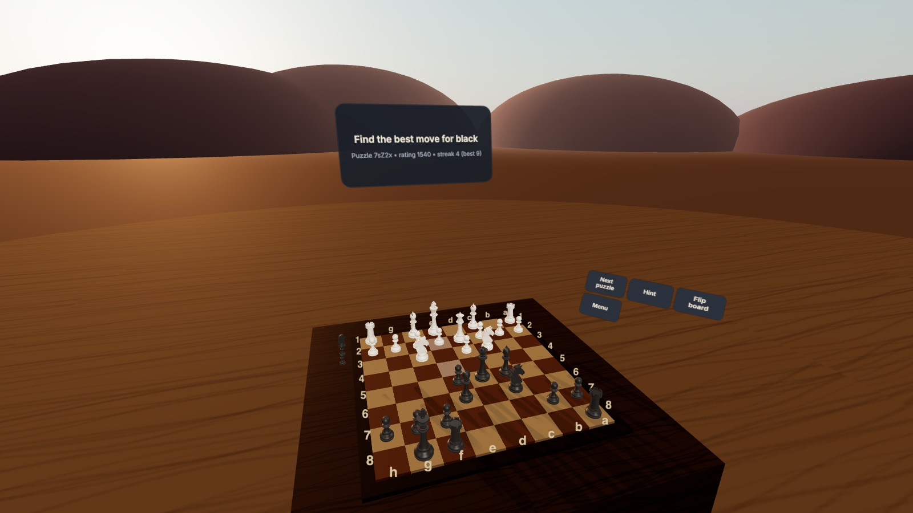
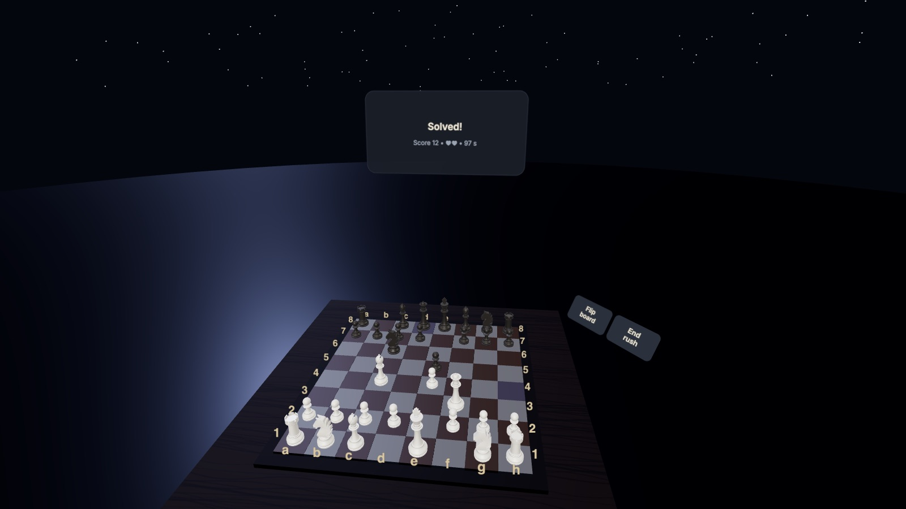
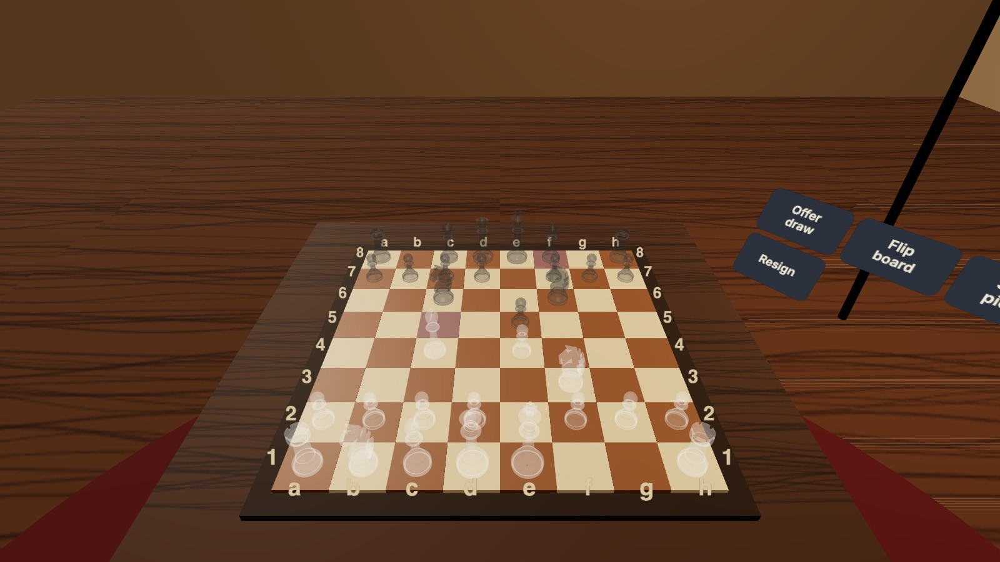
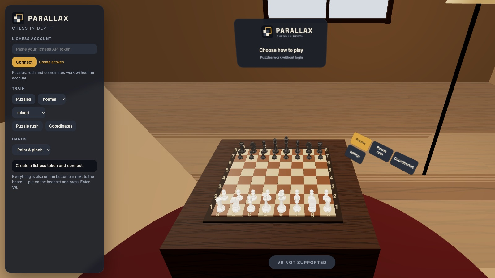

<p align="center"></p>

<p align="center"><b>Play lichess in VR and train the one thing flat screens can't: seeing the board in depth.</b><br>
Meta Quest · any WebXR browser · your real lichess account · no install, no build, no backend</p>



## Why

Most of us learned chess on a 2D diagram. Over a real board — or in VR — the same position
suddenly looks different. Parallax puts a tournament-size board on a table in front of you and
gives you everything you need to get fluent in 3D: real games, puzzles, drills and blindfold
training, all without taking the headset off.

## Features

**Play**
- **Your lichess account** — Stockfish (levels 1–8), the human-like **Maia** bots (1/5/9) or a
  seek against people. Resumes an ongoing game on load; survives headset sleep and network blips.
- **Premoves**, draw offers, takebacks, abort/resign (resign asks twice), claim the win when
  your opponent leaves, **Rematch** and a **Review** of the finished game on the board.
- **Promotion picker** — Q/R/B/N float over the last rank; underpromote in one pinch.

**Train**
- **Puzzles** from lichess with themes (mate in 1/2/3, forks, pins, skewers, endgames,
  openings), difficulty, hints and a streak counter.
- **Puzzle rush** — 3 minutes, 3 lives, rising difficulty.
- **Coordinates** — a square name appears, point at it; rounds alternate white's and black's view.
- **Blindfold** — ghost or hidden pieces with a 2-second "Show pieces", plus spoken moves.
- **Flip board** — look at your own game from the opponent's side.

**Feel**
- Four scenes — **Study**, **Sunset**, **Night**, **Minimal** — each lit so the board stays the
  clearest thing in view.
- Board size 80–150 %, table height by thumbstick or buttons, wooden move sounds, haptics.
- Controllers (point + trigger), hand tracking (point & pinch, or grab pieces), fingertip-poke
  buttons, or mouse on desktop.

| | | |
|---|---|---|
|  |  |  |
| Puzzles at sunset | Puzzle rush at night | Blindfold: ghost pieces |

## Get started

1. **Serve the folder** (any static server): `python3 -m http.server 8123`
2. **On the Quest** — WebXR needs a secure origin:
   - dev mode: `adb reverse tcp:8123 tcp:8123`, then open `http://localhost:8123` in the Quest browser;
   - or host the folder on any HTTPS server.
3. **Connect lichess** (optional for training) — create a token with `board:play` +
   `challenge:write`: [create token](https://lichess.org/account/oauth/token/create?scopes[]=board:play&scopes[]=challenge:write&description=Parallax),
   paste it, **Connect**. The token stays in your browser.
4. **Enter VR.** The button bar right of the board has everything: start a game, puzzles,
   rush, coordinates and settings.



## Good to know

- Seeks against humans must be rapid or slower (minutes + ⅔ × increment ≥ 8); blitz works
  against Stockfish and Maia. Bullet isn't available to third-party boards on lichess.
- Puzzle results aren't recorded to your lichess account.
- Supported variants: standard and from-position.

## Development

Static ES modules (Three.js 0.170 + chess.js 1.0 from a CDN import map). Architecture,
invariants and gotchas: [`CLAUDE.md`](CLAUDE.md). Brand & design system: [`BRAND.md`](BRAND.md);
tokens in [`src/theme.js`](src/theme.js).

```sh
node test/test.js && node test/hunt-unit.js   # pure logic
test/run-smoke.sh                              # 12 headless-Chrome suites, all must print *-OK
```

The smoke suites drive the real modules against a fake lichess (streams, reconnects, offers,
premoves), fake hands and controllers, and the real 2D page. `hunt-*` suites are regression
tests from adversarial bug hunts.
