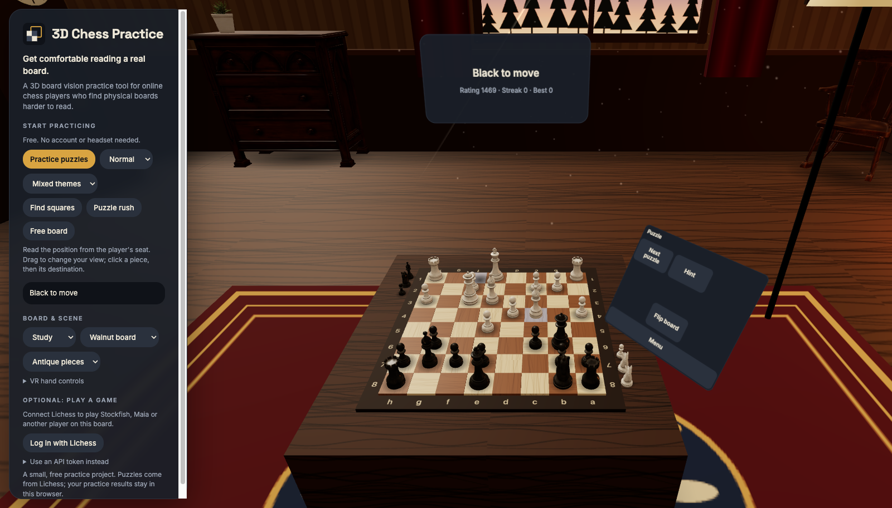

<p align="center"></p>

**A free 3D board vision practice tool for online chess players who find physical boards harder to read.**

If you are used to a flat online board, reading the same position from a player's seat can
feel unfamiliar. This small project gives you a 3D board to practice on: solve puzzles,
find squares, or move pieces around. It works in a desktop browser and optionally in VR.

[**Start practicing at chess.janasven.de**](https://chess.janasven.de/)

No account, installation or headset is needed for practice. A Lichess account is only needed
if you want to play games against Stockfish, Maia or another person.



## Try it

1. Open [3D Chess Practice](https://chess.janasven.de/).
2. Choose **Practice puzzles**, **Find squares**, or **Free board**.
3. Read the position from the player's seat. Drag to change the view; click a piece and then
   its destination. You can change the board, pieces and scene.
4. On a compatible headset, choose **Enter VR** to sit at the board. Point with a controller,
   point and pinch with your hands, or pick pieces up directly.

In VR, **Menu** opens Practice, Free board, Play and Settings. **Back** goes up one level;
**Return** takes you back to the same activity and position. Timed games and drills keep
running while you browse settings.

## Practice modes

- **Puzzles:** Lichess puzzles on a 3D board, with difficulty, themes, hints and a streak counter.
- **Find squares:** 30-second coordinate drills from both White's and Black's perspective.
- **Free board:** move both sides, Undo and Reset. Menu navigation preserves your move history.
- **Puzzle rush:** three minutes and three lives, with difficulty increasing as you solve.
- **Blindfold practice:** ghost or hide pieces, reveal them briefly, and optionally hear moves.
  These controls are under Practice → Puzzles → Piece visibility and Settings → Input & audio.

## Optional games and VR

Connect Lichess to play Stockfish, the Maia bots or another player on the same 3D board.
Games support premoves, draw and takeback responses, promotion, rematches and post-game review.
Seeks against humans require rapid or slower; blitz works for direct engine challenges.

In VR you can adjust table height and board size, switch between hand and controller input,
and use the same settings without leaving a game. Scenes include Study, Sunset, Night and
Minimal. Appearance changes are previews on the board, with visible setting choices.

On Quest, open [chess.janasven.de](https://chess.janasven.de/) in the browser. You can also use
*Install app*. The optional Android wrapper can be built with `android/build.sh` and installed
with `adb install -r android/app-release-signed.apk`.

## Data

Practice needs no login. Puzzles are fetched anonymously from Lichess. Puzzle results and
practice records stay in your browser and are not sent to your Lichess account. If you connect
Lichess for games, the login token stays in your browser.

## Run locally

1. Serve this folder: `python3 -m http.server 8123`.
2. Open `http://localhost:8123` in your browser.
3. WebXR requires HTTPS or localhost. For a Quest in developer mode, use
   `adb reverse tcp:8123 tcp:8123`, then visit `http://localhost:8123` on the headset.

## Development

Static ES modules (Three.js 0.170 + chess.js 1.0 from a CDN import map). Architecture,
invariants and gotchas: [`CLAUDE.md`](CLAUDE.md). Brand & design system: [`BRAND.md`](BRAND.md);
tokens in [`src/theme.js`](src/theme.js).

```sh
node test/test.js && node test/hunt-unit.js && node test/navigation-unit.js   # pure logic
test/run-smoke.sh                              # 14 headless-Chrome suites, all must print *-OK
```

The smoke suites drive the real modules against a fake lichess (streams, reconnects, offers,
premoves), fake hands and controllers, and the real 2D page. `hunt-*` suites are regression
tests from adversarial bug hunts.

## Credits

Chess pieces ([Chess Set](https://polyhaven.com/a/chess_set) by Riley Queen) and scene furniture
(`assets/props/`) are scanned models from [Poly Haven](https://polyhaven.com), CC0.
